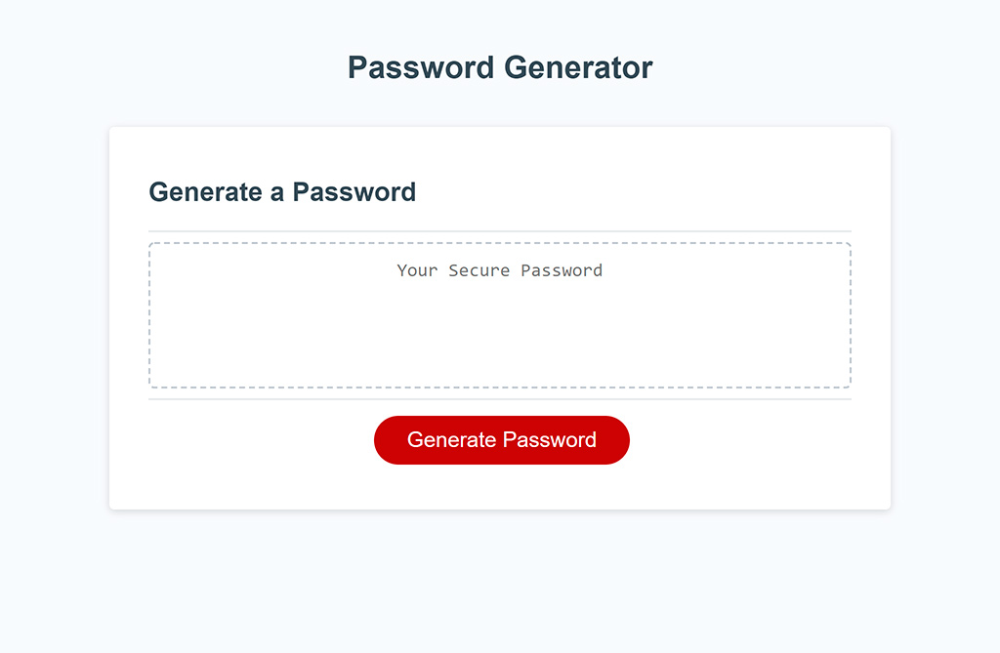

# JavaScript Password Generator

**Author: _Oleksandr Kulyk_**

**Preview link** - https://alexkuwerz.github.io/unh-js-password-generator/src/index

## Description

JavaScript Password Generator that generate random passwords with user's choiced characters types. After clicking on **Generate Password** button, the user is prompted to enter the number of password length from 8 to 128. If user enter a wrong value or cancel, alert message will appears in textarea. Then user should choose at least one of character types. Character types are lowercase, uppercase, numeric, and special. If user doesn't select at least one chars type, alert message will appears in textarea. The generated password is shown in the textarea.

## Technologies

HTML, CSS, JavaScript.

## Preview Image

* **Page View**

